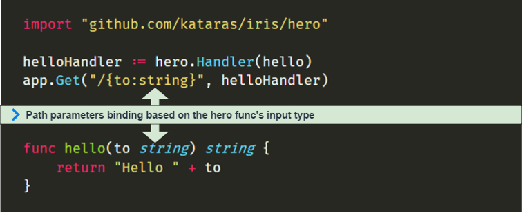
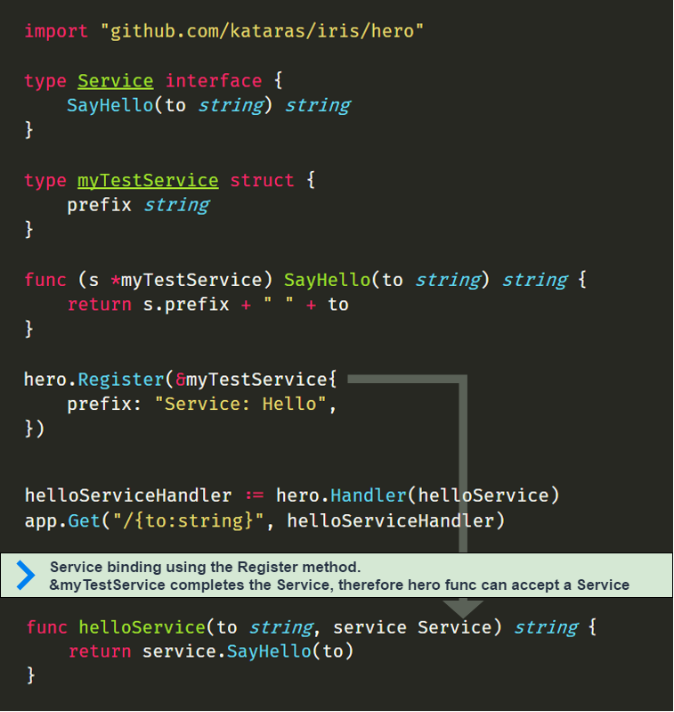
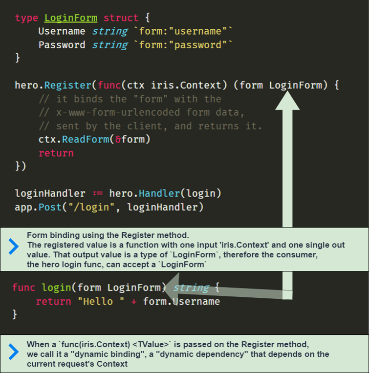

# Dependency Injection

The subpackage [hero](https://github.com/kataras/iris/tree/master/hero) contains features for binding any object or function that handlers can accept on their input arguments, these are called dependencies.

A dependency can be either `Static` for things like Services or `Dynamic` for values that depend on the incoming request.

With Iris you get truly safe bindings. It is blazing-fast, near to raw handlers performance because Iris tries to calculates everything before the server even goes online!

Iris provides built-in dependencies to match route's parameters with func input arguments that you can use right away.

To use this feature you should import the hero subpackage:

```go
import (
    // [...]
    "github.com/kataras/iris/hero"
)
```

And use its `hero.Handler` package-level function to build a handler from a function that can accept dependencies and send response from its output, like this:

```go
func printFromTo(from, to string) string { /* [...]*/ }

// [...]
app.Get("/{from}/{to}", hero.Handler(printFromTo))
```

As you've seen above the `iris.Context` input argument is totally optional. Of course you can still declare it as **first input argument** - Iris is smart enough to bind it as well without any hassle.

Below you will see some screenshots designed to facilitate your understanding:

## 1. Path Parameters - Built-in Dependencies



## 2. Services - Static Dependencies



## 3. Per-Request - Dynamic Dependencies



In addition the hero subpackage adds support to send responses through the **output values** of a function, for example:

* if the return value is `string` then it will send that string as the response's body.
* If it's an `int` then it will send it as a status code.
* If it's an `error` then it will set a bad request with that error as its reason.
* If it's an `error` and an `int` then the error code is the output integer instead of 400(bad request).
* If it's a custom `struct` then it sent as a JSON, when a Content-Type header is not already set.
* If it's a custom `struct` and a `string` then the second output value, string, it will be the Content-Type and so on.

```go
func myHandler(...dependencies) string |
                                (string, string) |
                                (string, int) |
                                int |
                                (int, string) |
                                (string, error) |
                                error |
                                (int, error) |
                                (any, bool) |
                                (customStruct, error) |
                                customStruct |
                                (customStruct, int) |
                                (customStruct, string) |
                                hero.Result |
                                (hero.Result, error) {
    return a_response
}
```

The `hero.Result` is an interface which help custom structs to be rendered using custom logic through their `Dispatch(ctx iris.Context)`.

```go
type Result interface {
    Dispatch(ctx iris.Context)
}
```

Honestly, `hero funcs` are very easy to understand and when you start using them **you never go back**.

Later on you'll see how this knowledge will help you to craft an application using the MVC architectural pattern which Iris provides wonderful API for it.

