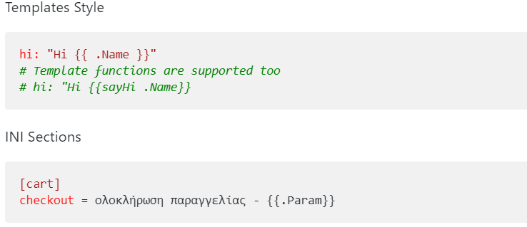

# Localization

## Introduction

Localization features provide a convenient way to retrieve strings in various languages, allowing you to easily support multiple languages within your application. Language strings are stored in files within the `./locales` directory. Within this directory there should be a subdirectory for each language supported by the application:

```sh
│   main.go
└───locales
    ├───el-GR
    │       home.yml
    ├───en-US
    │       home.yml
    └───zh-CN
            home.yml
```

The default language for your application is the first registered language.

```go
app := iris.New()

// First parameter: Glob filpath patern,
// Second variadic parameter: Optional language tags,
// the first one is the default/fallback one.
app.I18n.Load("./locales/*/*", "en-US", "el-GR", "zh-CN")
```

Or if you load all languages by:

```go
app.I18n.Load("./locales/*/*")
```

Then set the default language using:

```go
app.I18n.SetDefault("en-US")
```

### Load embedded locales

You may want to embed locales with a go-bindata tool within your application executable.

1. install a go-bindata tool, e.g.
  `$ go get -u github.com/go-bindata/go-bindata/...`
2. embed local files to your application
  `$ go-bindata  -o locales.go ./locales/...`
3. use the `LoadAssets` method to initialize and load the languages
 ^ The `AssetNames` and `Asset` functions are generated by `go-bindata`

```go
ap.I18n.LoadAssets(AssetNames, Asset, "en-US", "el-GR", "zh-CN")
```

## Defining Translations

Each file should contain keys with translated text or template values.

### Fmt Style

```yaml
hi: "Hi %s"
```



> YAML, TOML, JSON, INI files.

## Determining The Current Locale

You may use the `context.GetLocale` method to determine the current locale or check if the locale is a given value:

```go
func(ctx iris.Context) {
    locale := ctx.GetLocale()
    // [...]
}
```

The **Locale** interface looks like this.

```go
// Locale is the interface which returns from a `Localizer.GetLocale` metod.
// It serves the transltions based on "key" or format. See `GetMessage`.
type Locale interface {
    // Index returns the current locale index from the languages list.
    Index() int
    // Tag returns the full language Tag attached tothis Locale,
    // it should be uniue across different Locales.
    Tag() *language.Tag
    // Language should return the exact languagecode of this `Locale`
    //that the user provided on `New` function.
    //
    // Same as `Tag().String()` but it's static.
    Language() string
    // GetMessage should return translated text based n the given "key".
    GetMessage(key string, args ...interface{}) string
}
```

## Retrieving Translation

Use of `context.Tr` method as a shortcut to get a translated text for this request.

```go
func(ctx iris.Context) {
    text := ctx.Tr("hi", "name")
    // [...]
}
```

### INI Sections

INI Sections are separated by dot `"."`. The second optional value can be a `map` or a `struct` as the template value like the rest file formats.

```go
func(ctx iris.Context) {
    text := ctx.Tr("cart.checkout", iris.Map{"Param": "a value"})
    // [...]
}
```

## Inside Views

```go
func(ctx iris.Context) {
    ctx.View("index.html", iris.Map{
        "tr": ctx.Tr,
    })
}
```


## [Example](https://github.com/kataras/iris/tree/master/_examples/i18n)

```go
package main

import "github.com/kataras/iris/v12"

func newApp() *iris.Application {
	app := iris.New()

	// Configure i18n.
	// First parameter: Glob filpath patern,
    // Second variadic parameter: Optional language tags,
    // the first one is the default/fallback one.
	app.I18n.Load("./locales/*/*.ini", "en-US", "el-GR", "zh-CN")
	// app.I18n.LoadAssets for go-bindata.

	// Default values:
	// app.I18n.URLParameter = "lang"
	// app.I18n.Subdomain = true
	//
	// Set to false to disallow path (local) redirects,
	// see https://github.com/kataras/iris/issues/1369.
	// app.I18n.PathRedirect = true

	app.Get("/", func(ctx iris.Context) {
		hi := ctx.Tr("hi", "iris")

		locale := ctx.GetLocale()

		ctx.Writef("From the language %s translated output: %s", locale.Language(), hi)
	})

	app.Get("/some-path", func(ctx iris.Context) {
		ctx.Writef("%s", ctx.Tr("hi", "iris"))
	})

	app.Get("/other", func(ctx iris.Context) {
		language := ctx.GetLocale().Language()

		fromFirstFileValue := ctx.Tr("key1")
		fromSecondFileValue := ctx.Tr("key2")
        ctx.Writef("From the language: %s,
            translated output:\n%s=%s\n%s=%s",
			language, "key1", fromFirstFileValue,
			"key2", fromSecondFileValue)
	})

	// using in inside your views:
	view := iris.HTML("./views", ".html")
	app.RegisterView(view)

	app.Get("/templates", func(ctx iris.Context) {
		ctx.View("index.html", iris.Map{
			"tr": ctx.Tr, // word, arguments... {call .tr "hi" "iris"}}
		})

		// Note that,
        // Iris automatically adds a "tr" global
        // template function as well,
        // the only differene is the way you call
        // it inside your templates and
        // that it accepts a language code as
        // its first argument.
	})
	//

	return app
}

func main() {
	app := newApp()

    // go to http://localhost:8080/el-gr/some-path
    // ^ (by path prefix)
    //
    // or http://el.mydomain.com8080/some-path
    // ^ (by subdomain - test locally with the hosts file)
    //
    // or http://localhost:8080/zh-CN/templates
    // ^ (by path prefix with uppercase)
    //
    // or http://localhost:8080/some-path?lang=el-GR
    // ^ (by url parameter)
    //
	// or http://localhost:8080 (default is en-US)
	// or http://localhost:8080/?lang=zh-CN
	//
	// go to http://localhost:8080/other?lang=el-GR
	// or http://localhost:8080/other (default is en-US)
	// or http://localhost:8080/other?lang=en-US
	//
	// or use cookies to set the language.
	app.Run(iris.Addr(":8080"), iris.WithSitemap("http://localhost:8080"))
}
```

## Sitemap

[Sitemap](sitemap.md) translations are automatically set to each route by path prefix if `app.I18n.PathRedirect` is true or by subdomain if `app.I18n.Subdomain` is true or by URL query parameter if `app.I18n.URLParameter` is not empty.

Read more at: https://support.google.com/webmasters/answer/189077?hl=en

```sh
GET http://localhost:8080/sitemap.xml
```

```xml
<?xml version="1.0" encoding="utf-8" standalone="yes"?>
<urlset xmlns="http://www.sitemaps.org/schemas/sitemap/0.9" xmlns:xhtml="http://www.w3.org/1999/xhtml">
    <url>
        <loc>http://localhost:8080/</loc>
        <xhtml:link rel="alternate" hreflang="en-US" href="http://localhost:8080/"></xhtml:link>
        <xhtml:link rel="alternate" hreflang="el-GR" href="http://localhost:8080/el-GR/"></xhtml:link>
        <xhtml:link rel="alternate" hreflang="zh-CN" href="http://localhost:8080/zh-CN/"></xhtml:link>
    </url>
    <url>
        <loc>http://localhost:8080/some-path</loc>
        <xhtml:link rel="alternate" hreflang="en-US" href="http://localhost:8080/some-path"></xhtml:link>
        <xhtml:link rel="alternate" hreflang="el-GR" href="http://localhost:8080/el-GR/some-path"></xhtml:link>
        <xhtml:link rel="alternate" hreflang="zh-CN" href="http://localhost:8080/zh-CN/some-path"></xhtml:link>
    </url>
    <url>
        <loc>http://localhost:8080/other</loc>
        <xhtml:link rel="alternate" hreflang="en-US" href="http://localhost:8080/other"></xhtml:link>
        <xhtml:link rel="alternate" hreflang="el-GR" href="http://localhost:8080/el-GR/other"></xhtml:link>
        <xhtml:link rel="alternate" hreflang="zh-CN" href="http://localhost:8080/zh-CN/other"></xhtml:link>
    </url>
    <url>
        <loc>http://localhost:8080/templates</loc>
        <xhtml:link rel="alternate" hreflang="en-US" href="http://localhost:8080/templates"></xhtml:link>
        <xhtml:link rel="alternate" hreflang="el-GR" href="http://localhost:8080/el-GR/templates"></xhtml:link>
        <xhtml:link rel="alternate" hreflang="zh-CN" href="http://localhost:8080/zh-CN/templates"></xhtml:link>
    </url>
</urlset>
```